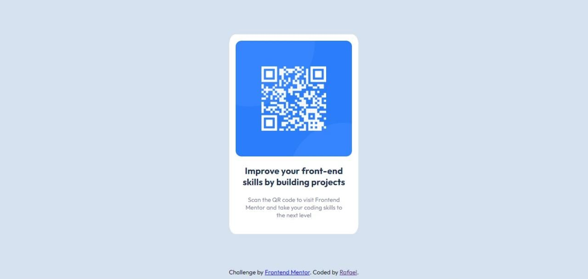
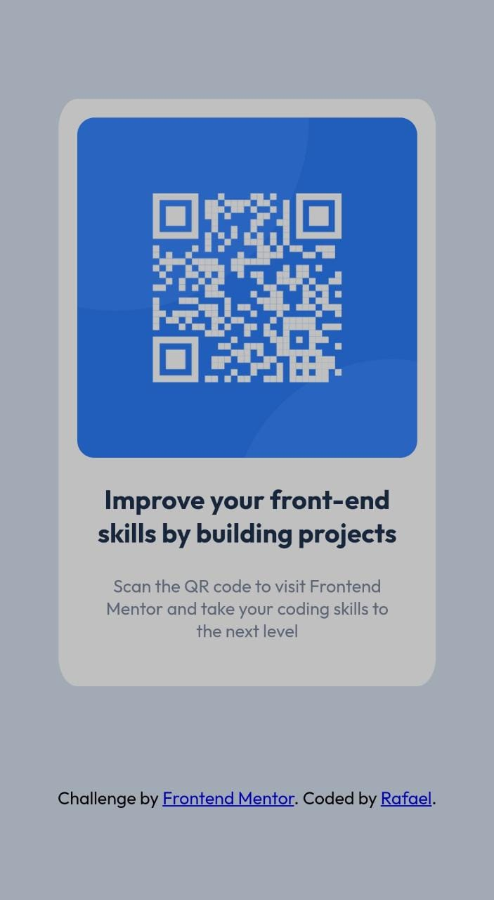

# Frontend Mentor - QR code component solution

This is a solution to the [QR code component challenge on Frontend Mentor](https://www.frontendmentor.io/challenges/qr-code-component-iux_sIO_H). Frontend Mentor challenges help you improve your coding skills by building realistic projects. 

## Table of contents

- [Overview](#overview)
  - [Screenshot](#screenshot)
  - [Links](#links)
- [My process](#my-process)
  - [Built with](#built-with)
  - [What I learned](#what-i-learned)
  - [Continued development](#continued-development)
  - [Useful resources](#useful-resources)
- [Author](#author)

## Overview

### Screenshot

### Links

- Solution URL: [Solution](https://github.com/RafaelRi23/qr-code-component-solution)
- Live Site URL: [Site](https://rafaelri23.github.io/qr-code-component-solution/)

## My process

### Built with

- Semantic HTML5 markup
- Flexbox
- Mobile-first workflow

### What I learned

Doing this challenge helped me to acquire more knowledge about flexbox. I'm becoming more familiar with it.

### Continued development

In my future projects I want to learn more about media queries, image sizes and CSS in general, I am struggling a bit with these.

### Useful resources

- [MDN Web Docs](https://developer.mozilla.org/pt-BR/) - This helped me when i was in doubt about some properties. Exceptional documentation.
- [Flexbox guide](https://css-tricks.com/snippets/css/a-guide-to-flexbox/) - This is an amazing article which helped me understand flexbox. I'd recommend it to anyone still learning this

## Author

- Github - [Rafael Ribeiro](https://github.com/RafaelRi23)
- Frontend Mentor - [@RafaelRi23](https://www.frontendmentor.io/profile/RafaelRi23)

